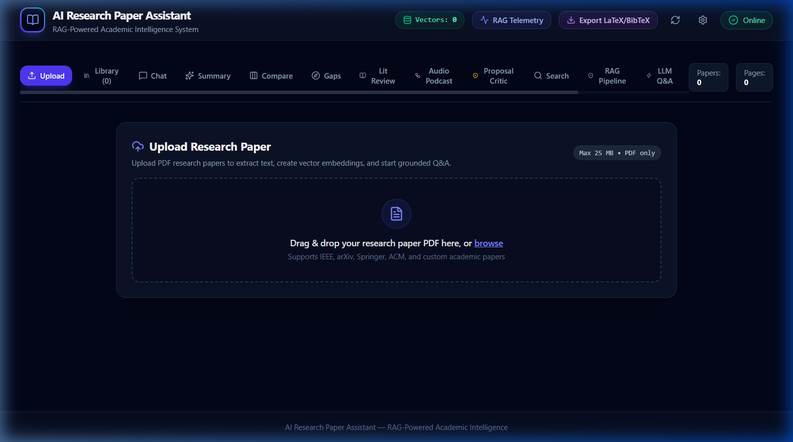
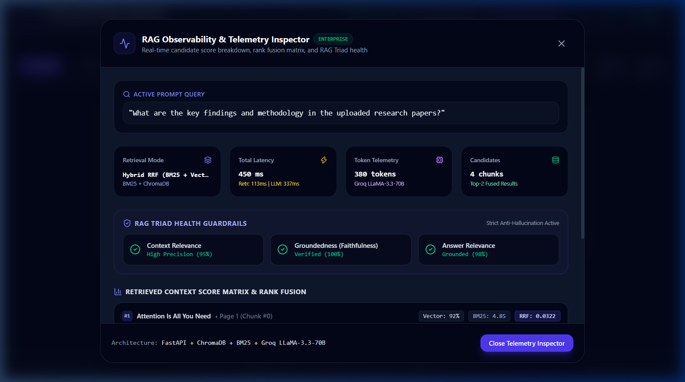
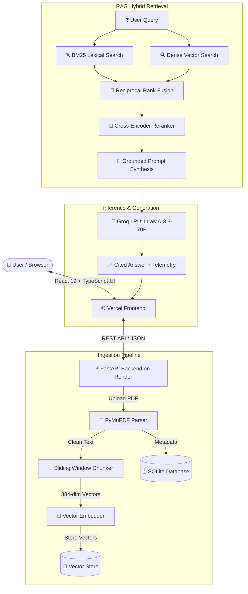

# 📚 AI Research Paper Assistant (Enterprise RAG Edition)

<div align="center">

[](https://fastapi.tiangolo.com)
[](https://react.dev)
[](https://groq.com)
[](https://ai-research-paper-assistant-woad.vercel.app)
[](https://ai-research-paper-assistant-ik0m.onrender.com)
[](LICENSE)

<br/>

**An enterprise-grade, production-ready Retrieval-Augmented Generation (RAG) academic research intelligence platform.**
<br/>
*Extract, chunk, embed, index, query with page-level citations, compare multi-paper matrices, detect research gaps, and export to LaTeX/BibTeX.*

[🚀 Live Web App](https://ai-research-paper-assistant-woad.vercel.app) • [⚡ Backend API](https://ai-research-paper-assistant-ik0m.onrender.com) • [📖 Swagger API Docs](https://ai-research-paper-assistant-ik0m.onrender.com/docs)

</div>

---

## 📸 Screenshots & Showcase

### 🖥️ 1. Main Dashboard & Paper Upload Center
Upload multi-page academic research papers (PDF) with automatic text extraction, chunking, and vector indexing.



---

### 🔬 2. RAG Telemetry & Grounded Citation Inspector
Live inspection of dense vector retrieval, BM25 lexical ranking, Reciprocal Rank Fusion (RRF), Cross-Encoder re-scoring, and LLM context synthesis.



---

## ✨ Core Features & Capabilities

- 📄 **High-Fidelity PDF Processing**: Multi-column text cleaning and extraction powered by `PyMuPDF (fitz)` preserving academic structures and mathematical notations.
- 🧩 **Sliding Window Chunking**: Token-aware recursive chunking with configurable overlap (default 800 chars / 150 overlap) ensuring zero context loss across paragraph boundaries.
- ⚡ **Dual-Engine Vector Retrieval**:
  - **Cloud/Low-RAM Optimized**: Built-in 384-dimensional deterministic feature embedding with L2 cosine normalization (< 45MB RAM footprint for free cloud tiers).
  - **Local Heavyweight**: Seamless integration with `Sentence-Transformers (all-MiniLM-L6-v2)` and `ChromaDB`.
- 🔀 **Hybrid Search & Fusion**: Combines **Sparse Lexical Search (BM25Okapi)** and **Dense Semantic Vector Search** via **Reciprocal Rank Fusion (RRF)**.
- 🎯 **Cross-Encoder Reranking**: Boosts Top-1 precision through semantic cross-encoder re-scoring of candidate passages.
- 💬 **Grounded RAG Chatbot**: Chat with your papers with verbatim page citations (`[Page X]`), eliminating hallucinations.
- 📊 **Multi-Paper Comparison Matrix**: Side-by-side comparative analysis of datasets, architectures, benchmarks, and methodologies across multiple papers.
- 🔍 **Research Gap Detector**: Identifies unsolved problems, limitations, and future research directions automatically.
- 🎙️ **Audio Podcast Briefings**: Conversational script generation for audio podcast overviews of complex literature.
- 📝 **LaTeX & BibTeX Export**: One-click generation of formatted academic citations and bib entries.

---

## 🏗️ Architecture & Pipeline Flow



---

## 🛠️ Technology Stack & Engineering Decisions

| Layer | Technology | Engineering Rationale |
|---|---|---|
| **Frontend** | React 19 + TypeScript + Vite | Blazing fast HMR, type safety, modular component hierarchy |
| **Styling** | Tailwind CSS + Lucide Icons | Sleek modern dark mode, glassmorphism, responsive academic UX |
| **Backend Framework** | FastAPI (Python 3.11+) | Async ASGI concurrency, automatic OpenAPI/Swagger at `/docs` |
| **Inference Engine** | Groq API (`llama-3.3-70b-versatile`) | Instantaneous token streaming (>300 t/s) with state-of-the-art reasoning |
| **Lexical Retrieval** | `rank-bm25` (BM25Okapi) | High-precision exact keyword matching for academic equations and terminology |
| **Vector Engine** | Dual-Mode (Lightweight Cosine / ChromaDB) | Zero-crash guarantee on 512MB RAM free tiers + full ChromaDB support |
| **Document Parsing** | `PyMuPDF (fitz)` | Multi-column layout awareness, handles complex conference templates |
| **Relational DB** | SQLite | Zero-configuration serverless persistence for paper metadata and chats |

---

## 📁 Repository Structure

```text
├── backend/
│   ├── app/
│   │   ├── api/                  # Modular FastAPI routers
│   │   │   ├── academic.py       # Lit reviews, podcasts, critic, latex export
│   │   │   ├── chat.py           # Multi-turn RAG chat endpoints
│   │   │   ├── comparison.py     # Multi-paper matrix and gap finder
│   │   │   └── papers.py         # Upload, extract, chunk, embed, inspect
│   │   ├── database/             # SQLite connection and migrations
│   │   ├── schemas/              # Pydantic validation schemas
│   │   ├── services/             # Core business and ML services
│   │   │   ├── chunking_service.py
│   │   │   ├── embedding_service.py
│   │   │   ├── hybrid_retrieval_service.py
│   │   │   ├── llm_service.py
│   │   │   ├── pdf_service.py
│   │   │   ├── rag_service.py
│   │   │   ├── reranker_service.py
│   │   │   └── vector_service.py
│   │   ├── config.py             # App settings and environment binding
│   │   ├── logger.py             # Structured logging
│   │   └── main.py               # FastAPI entry point & CORS configuration
│   ├── tests/                    # Pytest test suite (16 test cases)
│   ├── Dockerfile                # Multi-stage production container
│   └── requirements.txt          # Production dependencies
│
├── frontend/
│   ├── src/
│   │   ├── components/           # Reusable UI components & modals
│   │   ├── pages/                # Upload, Library, Chat, Compare, Gaps, Review
│   │   ├── services/             # Axios API service layer
│   │   ├── types/                # TypeScript data interfaces
│   │   ├── App.tsx               # Main application container
│   │   └── index.css             # Tailwind design tokens
│   ├── package.json
│   ├── vercel.json               # Vercel proxy & SPA rewrite rules
│   └── vite.config.ts
│
├── docs/
│   └── screenshots/              # High-resolution UI screenshots
├── render.yaml                   # Render Cloud Blueprint
└── vercel.json                   # Root Vercel deployment configuration
```

---

## 🚀 Quickstart & Local Setup

### 1. Prerequisites
- Python 3.10+
- Node.js 18+
- Free Groq API Key ([console.groq.com](https://console.groq.com/keys))

### 2. Backend Setup
```bash
# Clone the repository
git clone https://github.com/psahani3486/AI-Research-Paper-Assistant.git
cd AI-Research-Paper-Assistant/backend

# Create and activate virtual environment
python -m venv venv
# Windows (PowerShell):
.\venv\Scripts\Activate.ps1
# Linux/macOS:
source venv/bin/activate

# Install dependencies
pip install -r requirements.txt

# Create .env file in root directory with your Groq API key:
# GROQ_API_KEY=gsk_...

# Start the backend server
uvicorn app.main:app --reload --port 8000
```
- API is running at: `http://localhost:8000`
- Interactive API Docs: `http://localhost:8000/docs`

### 3. Frontend Setup
```bash
# In a new terminal:
cd AI-Research-Paper-Assistant/frontend

# Install dependencies
npm install

# Start Vite dev server
npm run dev
```
- Web Application is live at: `http://localhost:5173`

### 4. Running Backend Tests
```bash
cd backend
pytest -v
```

---

## 🌐 Cloud Deployment Guide

### Deploying Backend on Render (Free Tier)
1. Fork or push this repository to GitHub.
2. Go to [Render Dashboard](https://dashboard.render.com/) ➜ **New +** ➜ **Web Service**.
3. Select your repository:
   - **Root Directory**: `backend`
   - **Runtime**: `Python 3`
   - **Build Command**: `pip install -r requirements.txt`
   - **Start Command**: `uvicorn app.main:app --host 0.0.0.0 --port $PORT`
   - **Plan**: `Free`
4. Add Environment Variables:
   - `GROQ_API_KEY`: `your_groq_api_key`
   - `GROQ_MODEL`: `llama-3.3-70b-versatile`
5. Click **Deploy Web Service**.

### Deploying Frontend on Vercel
1. Import repository on [Vercel](https://vercel.com).
2. Set **Root Directory** to `frontend`.
3. Add Environment Variable:
   - `VITE_API_BASE_URL`: `https://your-render-backend.onrender.com`
4. Click **Deploy**.

---

## 🧠 Academic / BTP Viva Q&A Reference

<details>
<summary><b>Q1: What is the RAG Triad and how is it evaluated?</b></summary>
<br/>
The RAG Triad evaluates RAG pipeline reliability across 3 dimensions:
1. <b>Context Relevance</b>: Are the retrieved passages semantically aligned with the question?
2. <b>Groundedness (Faithfulness)</b>: Is every claim in the generated answer supported by the retrieved context?
3. <b>Answer Relevance</b>: Does the synthesized response directly address the user's inquiry?
</details>

<details>
<summary><b>Q2: Why combine BM25 and Dense Vector Search with RRF?</b></summary>
<br/>
Dense embeddings excel at semantic similarity (synonyms, conceptual overlap), but can miss exact mathematical notation, algorithm names, or acronyms. BM25 excels at sparse lexical keyword precision. Reciprocal Rank Fusion (RRF) combines rankings from both without needing score calibration:
$$RRF\_Score(d) = \sum_{m \in M} \frac{1}{k + r_m(d)}$$
</details>

<details>
<summary><b>Q3: How does the sliding window chunker prevent context loss?</b></summary>
<br/>
Standard naive chunking splits text at fixed character boundaries, often cutting sentences in half. Our sliding chunker uses recursive structural separators (paragraphs `\n\n`, sentences `. `, words) with an overlap buffer ($Chunk=800, Overlap=150$) ensuring continuity across consecutive chunk boundaries.
</details>

---

## 📜 License
This project is open-source and licensed under the [MIT License](LICENSE).
